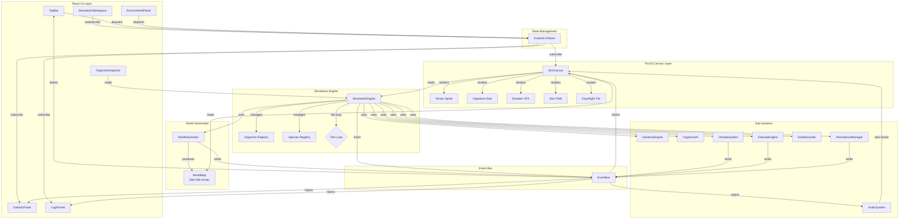

# Welcome to Real Earth Simulation Setup 🌍

**Real Earth Simulation Setup** is a living universe simulator and evolution sandbox. Step into the role of an unseen geologic force and watch life emerge, compete, speciate, and go extinct across a dynamically generated planet.

🌐 **Live Demo:** [https://app-cf4t2flxxuyp.appmedo.com](https://app-cf4t2flxxuyp.appmedo.com)

---

## What is Real Earth Simulation Setup?

Real Earth Simulation Setup simulates a complete ecosystem on a procedural world. From primordial oceans to alpine tundra, organisms spawn in biome-appropriate habitats, hunt, flee, mate, and evolve. Disasters reshape the landscape, climate shifts drive mass migrations, and every session writes a unique history of life on your planet.

Key features:

- **Procedural World Generation** — Every planet is unique. Terrain, rivers, lakes, and biomes are generated from a seed.
- **Biome-Aware Ecosystems** — 95+ species spawn in their preferred habitats: rainforests, grasslands, deserts, oceans, tundra, alpine peaks, wetlands, and rivers.
- **Real-Time Evolution** — Watch speciation and extinction events unfold. Track population dynamics, genetic drift, and adaptive radiation.
- **Day / Night Cycle** — A living canvas that transitions from dawn to dusk to starlit night.
- **Climate & Disaster Systems** — Trigger volcanoes, meteors, wildfires, floods, epidemics, and more. Climate variables shift over deep time.
- **Event Log** — A rich, filterable log of every extinction, speciation, disaster, and climate shift with coordinates and impact details.
- **Data Visualization** — Live population charts, species diversity metrics, and biomass trends.
- **Autosave & Persistence** — Your world is automatically preserved. Resume anytime.

---

## Tech Stack

| Layer | Technology |
|-------|------------|
| Frontend | React 19 + TypeScript |
| Canvas | PixiJS v8 (WebGL) |
| UI | Tailwind CSS + shadcn/ui |
| State | Zustand |
| Build | Vite |
| Audio | Web Audio API |

---

## Getting Started

### Prerequisites

- Node.js ≥ 20
- npm ≥ 10

### Installation

```bash
# Clone the repository
git clone <repository-url>
cd evosphere

# Install dependencies
npm install

# Start the development server
npm run dev
```

The app will be available at `http://localhost:5173` by default.

### Build for Production

```bash
npm run build
```

The production bundle will be output to the `dist/` directory.

### Deploy to Production

See [`DEPLOYMENT.md`](DEPLOYMENT.md) for step-by-step guides for **Vercel**, **Netlify**, and **GitHub Pages**.

---

## Project Structure

```
├── public/              # Static assets
├── src/
│   ├── components/
│   │   ├── canvas/      # SimCanvas (PixiJS world renderer)
│   │   ├── panels/      # Environment, DataViz, Logs, Inspector
│   │   └── ui/          # TopBar, dialogs, overlays
│   ├── lib/
│   │   ├── SimulationEngine.ts   # Core tick loop & entity registry
│   │   ├── WorldGenerator.ts       # Procedural terrain & biome generation
│   │   ├── GeneticsEngine.ts       # Mutation & gene templates
│   │   ├── OrganismAI.ts           # Behavior state machines
│   │   ├── ClimateSystem.ts        # Climate variable simulation
│   │   ├── DiseaseEngine.ts        # Epidemic spread model
│   │   ├── EventBus.ts             # Typed cross-module events
│   │   ├── AudioSystem.ts          # Procedural biome ambience
│   │   └── PersistenceManager.ts   # Save / load / autosave
│   ├── store/
│   │   └── UIStore.ts              # Zustand state management
│   ├── types/
│   │   └── simulation.ts           # Shared TypeScript types
│   ├── pages/
│   │   └── SimulationWorkspace.tsx # Main layout grid
│   ├── App.tsx
│   └── main.tsx
├── index.html
├── vite.config.ts
├── tsconfig.json
└── package.json
```

---

## Architecture

Real Earth Simulation Setup follows a modular, event-driven architecture that separates simulation logic from rendering and UI concerns.

### System Interaction Diagram



### Key Architectural Principles

| Principle | Implementation |
|-----------|----------------|
| **Separation of Concerns** | SimulationEngine never imports React; SimCanvas never writes to Zustand directly (only reads via `getState`) |
| **Event-Driven Communication** | All cross-module messages flow through the typed `EventBus` (e.g., `sim:world-generated`, `disaster:triggered`, `species:extinct`) |
| **Canvas-First Rendering** | PixiJS handles all world rendering; React overlays (panels, legends, tooltips) float above with `pointer-events` layering |
| **Performance Isolation** | The render loop batches organism dots by color into single `Graphics` calls. No per-organism sprite creation. Math.random() is banned from the hot path |
| **State Hygiene** | Zustand updates are throttled (sim stats every 10 frames, day/night every 60 frames) to prevent React re-render cascades |

---

## Controls

| Action | Control |
|--------|---------|
| Pan camera | Click + drag |
| Zoom | Mouse wheel |
| Select organism | Click on dot |
| Place species | Select from catalog → click on map |
| Pause / Play | Top bar speed buttons |
| Screenshot | Camera icon in top bar |
| Settings | Gear icon in top bar |

---

## Simulation Concepts

### Biomes

The world is divided into 11 biome types, each with unique elevation, moisture, and temperature profiles:

- **Deep Ocean** — Dark navy trenches, teeming with marine life
- **Coastal / Shore** — Light cyan shallows where land meets sea
- **Wetland / Swamp** — Dark teal marshes, high moisture
- **Tropical Rainforest** — Deep emerald canopy, highest biodiversity
- **Temperate Forest** — Medium olive woodlands with seasonal change
- **Grassland / Plains** — Warm yellow-green open ranges
- **Desert / Arid** — Sandy amber dunes, harsh conditions
- **Tundra** — Pale blue-gray frost plains
- **Alpine / Mountain** — Cold gray-white peaks with snow caps
- **River** — Bright blue veins of fresh water
- **Lake** — Shallow inland water bodies

### Organism States

Each organism has a behavior state that affects its glow and movement:

- **Idle** — Neutral color
- **Eating** — Green glow
- **Hunting** — Red glow
- **Fleeing** — Orange glow
- **Mating** — Pink glow

### Disasters

Natural disasters can reshape ecosystems:

- 🌋 **Volcano** — Lava flow and ash cloud
- ☄️ **Meteor** — Impact flash and crater ring
- 🔥 **Wildfire** — Expanding burn zones
- 🌊 **Flood** — Blue wave expansion
- 🦠 **Epidemic** — Spreading disease rings
- ❄️ **Glaciation** — Ice age onset

---

## License

MIT License — feel free to fork, modify, and build upon Real Earth Simulation Setup.

---

*Built with curiosity about life, evolution, and the beauty of emergent systems.*
